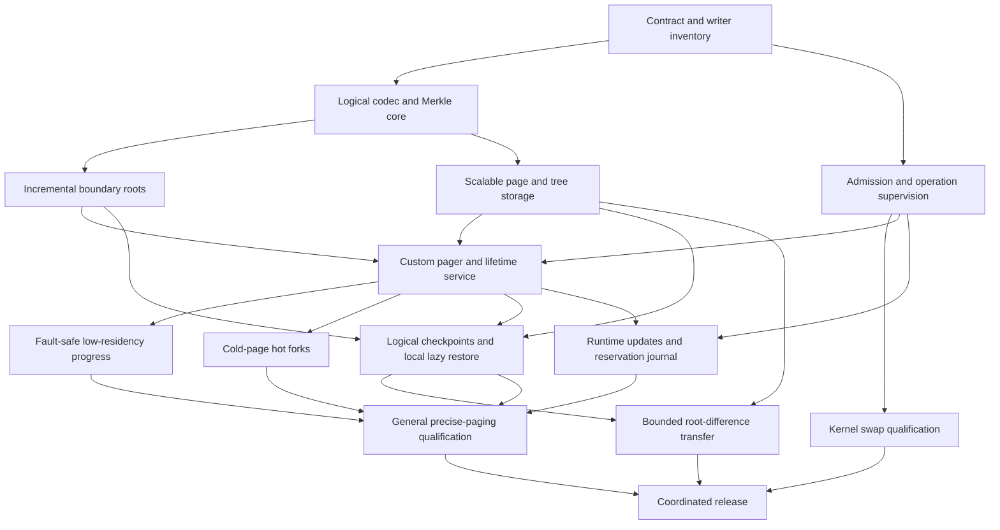

# 11 - Implementation sequence and release evidence

## 11.1 Delivery model

This is a design-only RFC. Acceptance does not enable swap, change production
fingerprints, or advertise a new executor capability. Implementation proceeds
in reviewable work packages with explicit evidence. Staging phases are not a
backward-compatibility program: old and new incompatible contracts are never
accepted together by the deployed runtime. The final cutover is coordinated.

The dependency graph below distinguishes foundations from separately enabled
capabilities. `A -> B` means B requires A's accepted contract and evidence.

Some code may be developed in parallel, but no gate can use another unfinished
phase as assumed proof. A generic `supports_paging` bit is insufficient:
backend, mapping mode, fork, lazy restore, strict residency, and fault-safe
reclaim capabilities must be advertised independently.

The graph's node labels describe capability dependencies, not the delivery
package letters used below. Some packages combine capabilities for review:
Package I covers cold forks and local lazy restore; Package J covers live
control and bounded transfer. That grouping does not remove their independent
qualification gates or imply an atomic cross-machine operation.

- **[PLAN-1]** Implementation MUST maintain a conformance matrix mapping
  every normative requirement to owning components, positive evidence,
  negative/adversarial evidence, and the backend/release capability it gates.
  An unimplemented or unqualified requirement MUST block the corresponding
  advertised capability.
- **[PLAN-2]** Before enabling a public schema, maintainers MUST specify its
  complete canonical byte layout, numeric tags, bounds, state machine,
  atomic ordering where shared memory is used, and independent C/Rust
  vectors. Semantic record sketches in this RFC MUST NOT be treated as an
  implicit permission to ship native-layout or unspecified wire contracts.

## 11.2 Package A: contract inventory and independent oracle

Deliver a machine-profile RAM inventory with stable region IDs, alias owners,
class/mask declarations, immutable reconstruction references, and every
supported write origin. For each writer, record the actual QEMU dirty hook,
its covered geometry, caller lifetime, and consumer epochs. Identify external
kernel reads/writes through guest pointers, device pre-save mutations, bulk
reset/restore, fault injection, and cached DMA stores.

Separate the complete RAM read-resolution inventory from writable fault-target
admission. The existing mutation mapping filter excludes readonly, ROM, and
RAM-device regions; pager lookup must cover admitted cold reads of those regions
without granting mutation rights. Include retained raw/DMA borrowers and kernel
pins even with fault rules disabled. Inventory persistent retention/rowhammer
mutations, guest-RAM hardware-reporting writes, and modeled memory-service
tickets/frozen loads/deferred stores. Reconcile the host/GPL service payload
contract, including actor fields, before claiming live service coverage.
Operational copies must not exercise simulated access opportunities or timing.

Define the new fingerprint and checkpoint editions and enumerate all consumers:
production execution, exact snapshot, harness, instruction fault state,
lifecycle preconditions/source seals, trace, and persisted canonical samples.
Create an independent full-RAM Merkle oracle that does not reuse dirty bits,
cached roots, incremental code, or the production tree builder. Instrument
tests so suppressing a required dirty notification demonstrably fails.

Exit evidence is a complete inventory with no unclassified supported writer,
a precise coverage map for all named scopes, and oracle detection of deliberate
false negatives. A source audit alone does not qualify a memory backend.

## 11.3 Package B: canonical logical core

Implement chapter 02 in the boundary-appropriate components without acquiring
QEMU dependencies in permissive crates. Portable codecs are bounded and use
checked arithmetic. Persistent trees carry immutable ownership; page-version
and dirty-epoch state remain separate from digests. Build sparse zero trees,
batch dirty updates, reuse equal-content pages, and account for dense/padded
metadata limits.

Exit evidence includes the executable positive vectors specified in chapter 02,
independently produced C/Rust results, malformed and overflowing encodings,
wrong scope/topology, partial pages, reordered pages, padding proofs, and
representation-independent roots.
Retained nodes must remain valid through concurrent root users and teardown.

Build the GPL-side C hash implementation hermetically from pinned reviewed
upstream source, recording its applicable GPL-compatible license choice and
corresponding-source obligations. The Apache-side Rust implementation remains
in its separate process. Validate the official primitive vectors, the selected
unkeyed 32-byte mode, and agreement across enabled portable/SIMD paths before
enabling the logical codec. A shared algorithm MUST NOT introduce a cross-process
QEMU library dependency or conflate logical digests with CAS object identities.

## 11.4 Package C: resource model and granular supervision

Refactor admission around uniquely owned source pages, private child changes,
metadata, compulsory host memory, emergency buffers, disk capacity, and I/O
capacity. Maintain attempt/executor aggregate containment and account for
original cgroup ownership of COW charges. Do not convert full-RAM accounting
to a guessed working-set number before a backend has a progress proof.

Introduce operation classes and consistent monotonic start/progress/completion
coordinates. Separate modeled deadlines from host budgets. Cover QMP, quantum,
capture, publication, restore, page-in, preservation, fork barrier/rearm,
transfer, cancellation, and reaping. Ensure the outer watchdog follows the
same explicitly authorized completion contract and cannot silently defeat an
accepted latency configuration. Reconcile QEMU-internal placement waits and
host-side deadlines. Make operational controls independently responsive while
QMP and guest execution stall.

Enforce TIME-9's finite infrastructure-phase bounds at admission and on every
live update. Implement the separate outer-cap amendment transaction, shared
watcher wakeup, original-start retention, expiry precedence, durable recovery,
bounded idempotency history, and limiting-deadline status. An updated caller
duration without rebinding every affected supervisor is not complete.

Exit evidence includes nested deadlines, in-flight updates, rollback of refused
reservations, restart recovery, prolonged legitimate progress, endless paging
without guest progress, cancellation, and quarantine that remains charged.

## 11.5 Package D: kernel-managed swap baseline

Add explicit host prerequisites and configurable swap limits while retaining
the existing default behavior unless the operator selects the backend. Probe
usable swap and cgroup delegation. Document that cgroup swap and memory limits
apply to an aggregate owner, including file cache and emulator overhead.
There is no precise per-VM cache guarantee from `mmap`, global swappiness,
or an attempt-level cgroup alone. Package D is a labeled measurement baseline:
operator selection permits the experiment, not authenticated-backend deployment.
Advertising a supported backend requires PAGER-22's separate integrity proof;
this edition does not silently trust swap bytes or narrow TEST-7's threat model.

Measure deterministic equality and host throughput for resident, swap-enabled,
and constrained-memory runs. These measurements supply a realistic comparison
for the custom pager. Exit evidence includes actual swap activity, multiple
nodes, source/child accounting, adverse storage latency, and host failure
classification. The test must demonstrate paging occurred rather than merely
setting a sysctl or allocating a file.

## 11.6 Package E: incremental observation cutover

Replace all full-RAM production observers with named roots and a shared logical
edition. Preserve coherent capture ordering, request-generation publication,
and independent dirty clients. Restores install authenticated roots or force
complete reconstruction; resets establish their specified logical contents.
Do not hash mutable RAM from an asynchronous worker after guest resume.

Exit evidence is equality with the independent oracle at every tested boundary
across every writer, including write-then-revert and unchanged cold pages.
The normal fingerprint path must demonstrably avoid faulting the complete
unchanged address space into memory. Selected-range fault digests remain
separately specified where full-state identity does not answer the predicate.

## 11.7 Package F: scalable durable memory storage

Define page objects, portable structural records, complete root manifests,
packing, bounded index traversal, admission limits, and retained closure
ownership. Separate logical BLAKE3-256 digests from existing representation
identities, even where both use the same hash primitive.
Replace flat assumptions that cannot handle worst-case distinct 4 KiB pages.
Make tree/page verification and retrieval bounded without eagerly loading a
complete machine's page catalog into host memory.

Exit evidence includes dense distinct pages beyond former flat limits,
small-object overhead measurements, packed-object corruption, quota failure,
crash during publication, concurrent GC, and retained source/child/transfer
leases. An ordinary spill write is not accepted as durable publication.

## 11.8 Package G: custom pager and authority lifecycle

First implement stable mappings, missing-page service, page/version state
transitions, preserved backing, immutable authenticated reads, controlled
writeback, and paused-boundary removal. Qualify the deployed userfaultfd
features, permissions, kernel-originated faults, and mapping semantics.
Retain registration authority across companion failure until QEMU can be
stopped; closing the final authority must not expose default zero faults.

The proposed GPL-side companion owns native addresses and mapping details.
Its public storage requests use bounded portable identifiers and checked
offsets. Prove its service cannot depend on a barrier held by an accessing
QEMU thread, and reserve its minimum service resources. License and ABI
review precedes adoption of this placement.

Initial acceptance includes PAGER-23's physical-access lifetime proof for
retained DMA/raw mappings, kernel pins, aliases, and observation readers.
Reserve the sound inter-boundary peak before admitting the paused-only backend;
unsupported peak reductions are refused rather than admitted with expected
runtime failure. Cold fault-transaction preparation must secure all fragments'
versions, COW rights, and commit resources before any write, under TRACK-20.

Exit evidence includes missing/short/corrupt backing, delayed and stale I/O,
companion death, kernel fault denial, mapping removal events, cleanup races,
and preservation failure before discarding the last correct resident version.

## 11.9 Package H: fault-safe low-residency progress

Paused-boundary eviction is a correctness baseline, not sufficient proof of
general low-residency progress. A guest can touch more pages in one quantum
than its admitted resident peak. A blocked fault cannot wait for an exact
boundary that the fault itself prevents the guest from reaching.

- **[PLAN-3]** General precise paging with a strict peak below the worst-case
  inter-boundary footprint MUST remain disabled until the implementation
  proves either a fault-safe resource suspension/reclaim boundary reachable
  during a blocked access, or safe concurrent removal with complete CPU,
  DMA, raw-pointer, and read-lifetime protection. Neither approach MAY inject
  a guest-visible event or modeled time step. Initial paused-only operation
  MUST reserve its sound interval peak and refuse unsupported smaller admission
  or live peak reductions. Unexpected resource loss after valid admission MUST
  fail operationally before exhausting the independent progress reserve.

Resource suspension requires a complete stop protocol that can progress while
a vCPU or device thread is blocked in a host fault, including mutex ownership,
BQL constraints, event-loop work, pager callbacks, and any dirty re-arm work.
Qualification identifies the actual discard executor and kernel primitive,
not just an independent fetch companion. A local worker needs a closed
thread/mutex plan and child reconstruction. Operational holds cannot use ordinary
host-timed CPU kicks or semantic vmstop publication without proving unchanged
interrupt checks, RR allocation, timer/device order, and partial operation state.
Concurrent removal requires a different proof: preserving every latest write,
rejecting stale I/O, preventing stale physical references or bypass of the
qualified fault path, and covering all device/DMA lifetimes. Benchmark gains
do not replace either proof.

Exit evidence includes an unmodified guest whose single quantum touches more
distinct pages than the resident peak, without extra reservation capacity,
and equivalent scenarios during device activity and runtime target reduction.
For the general backend the run must make bounded progress with correct bytes.
For the limited baseline unsupported admission must be refused; a distinct
post-admission resource-loss adversary must terminate safely. Neither case may
deadlock, substitute zeroes, or depend accidentally on extra host RAM.

## 11.10 Package I: cold forks and local lazy restore

Integrate fault authority into the entire hot-fork transaction before child
reconstruction. Establish child-specific mutable epochs, private preserved
versions, fault contexts, registrations, reservations, and readiness. Strict
residency requires independent child prefault/lock establishment. Shared
immutable backing stays pinned; source residency can change without changing
its logical seal. Quarantine retains all unresolved ownership.

Replace eager sealed-RAM restore with the new authenticated local closure
contract. CPU/device and continuation reconstruction remain coherent. Verify
complete local durable availability before launch, and each page before it
is exposed. Cold reads during device restore must be serviced independently.
No remote-page server is implied.

Capture establishes CHECK-13's disposition barrier for pending pager and policy
work. Restore constructs fresh controller/registration/request namespaces and
independent consumer baselines under CHECK-14. Source I/O completions cannot
be replayed into the restored owner. Existing modeled fault/service continuation
must remain intact and resume its admitted semantic effects exactly once.

Exit evidence includes mostly cold sources, fork barrier adversaries, child
reconstruction reads, failed rearm, source death, child cancellation, descendants,
promotion, dense COW writes, and lazy restore matching exact continuation.

## 11.11 Package J: live control and transfer

Implement generation-bound, authenticated, revisioned, idempotent policy
updates and status. Add bounded operational history and reservation amendments.
Keep accepted, applied, effective, and converged states distinct. Reductions
release capacity only after ownership is gone; increases reserve first. Restart
reconciliation must distinguish accepted-but-not-applied from applied-but-not-
reported operations. Hard update-history capacity must not consume fault-service
emergency memory.

Implement bounded root-difference traversal, paged inventories, authenticated
destination possession, source retention, cancellation between I/O chunks,
durable progress receipts, and atomic reference publication. Resume records
must bind both the transfer incarnation and selected source roots. A transfer
of VM state includes the non-RAM checkpoint closure, not just page contents.

Exit evidence includes runtime tuning during blocked faults and forks,
idempotent retry across restart, revision conflicts, quota exhaustion, dropped
transfer sessions, corrupt destination claims, partial receipts, and publication
only after complete authenticated durable possession.

Archive transfer completes with `ClosureStored` and ordinary archive selection
retention on a storage-only destination. Maintenance additionally requires
`RestoreReady`, current execution admission, and the durable ownership transition.
Test stale readiness before handoff and independently refused later restore;
neither publication nor source lease retirement implicitly grants execution.

## 11.12 Coordinated release and documentation

- **[PLAN-4]** The release MUST update the compatibility registry atomically
  with all affected protocol, fingerprint, trace, checkpoint, and policy
  definitions. Capability advertisement MUST match enabled and qualified
  implementations. Noncurrent peers and artifacts MUST fail before execution.
- **[PLAN-5]** Release qualification MUST pass the repository ABI and license
  gates, preserve QEMU file licenses, co-retain complete corresponding source,
  and use hermetically built AOS dependencies. New kernel/filesystem requirements
  MUST be checked on the actual deployment host, not inferred from headers.

Publish canonical operational documentation for supported backends, prerequisite
checks, resource-floor calculation, runtime controls, typed failures, cleanup,
and recovery. Keep this RFC as the historical design record. Record measured
baseline and performance budgets without inventing a prior approval: the current
campaign performance gate has a blocked/unapproved baseline at the cited source
revision. Deferred remote paging or live migration receives its own design and
qualification rather than inheriting an unsupported capability flag.
