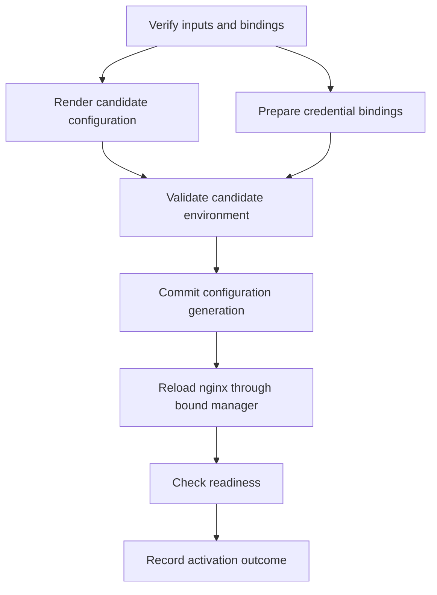

# Structured activation, rollout, and rollback

## From ability composition to a transition plan

The activation portion of this framework makes runtime transitions first-class.
Nix authors desired state and provider-owned transition descriptions; Rust
validates and executes concrete plans against the host and its delegated
environments. Building a static configuration graph is not, by itself, runtime
activation. Build-time dependency consumption remains another use of the
broader ability model.

The complete ability graph describes providers, consumers, resources, and
guarantees. It is not a script to traverse and execute unconditionally.
Activation combines current state, desired state, authorized bindings, and
observations to determine which effects are necessary.

```text
Package and environment ability graph
  + current generation and observations
  + desired configuration and operator policy
  -> binding validation and change calculation
  -> provider-composed operation graphs
  -> validated effect plan
  -> execution journal and observed outcome
```

An unchanged library edge may require retention but no execution. A changed
configuration contribution may require rendering and a reload. A changed
payload can require a restart even when the configuration is unchanged.

Source-defined images may precompute bindings and transition templates. APM
may compose them later from authenticated registry packages. Both paths still
require current-state checks, scoped runtime handles, and execution evidence.
Pure Nix evaluation never performs the described host effects.

NixOS also has runtime switching, activation, and service restart/reload logic;
it does not activate a machine merely by evaluating a static graph. The
proposed difference is explicit, typed, recursively provider-authored transition
contracts that expose authority, dependencies, and recovery. See the upstream
[system-switch description](https://github.com/NixOS/nixpkgs/blob/master/nixos/doc/manual/development/what-happens-during-a-system-switch.chapter.md).

The existing [graph compiler](../../../crates/aos-package/src/graph_compile/mod.rs)
already uses systemd for provisioning order, parallelism, and failure isolation.
The existing [activation implementation](../../../crates/aos-package/src/config_eval/activation.rs)
owns configuration commit and generation publication. Extend those boundaries
rather than introducing a competing service supervisor.

## A typed execution language represented as data

Define a small, versioned operation representation with a Rust planner,
validator, and executor. Nix remains the authoring language. Rust enums and
validated types represent built-in operations; registered provider protocols
implement additional authorized operations. This is an execution language in
the sense of a precisely defined instruction set, not a new general-purpose
source language.

Providers can compose named operations into nested subgraphs. The planner
expands or schedules these through explicit inputs, outputs, dependencies,
authority, and failure boundaries. Expansion is bounded; provenance and
semantic grouping remain visible even if scheduling uses a flattened graph.

A shared subgraph is not deduplicated solely because its operation names or
payloads match. Its consumer, resource scope, transaction identity, and sharing
contract must also permit one execution to serve both requests.

Ordinary plans are finite. The operation graph for one attempt is acyclic;
bounded retries, recovery, and reboot continuation belong to the durable
execution state machine. General recursion, arbitrary evaluation, and unbounded
loops are not supported plan features. A future extension needs explicit
termination, authority, and compatibility rules.

Haskell or another host language could express an operation algebra, but
introducing a third authoring/runtime language provides no necessary property
here. Rust fits the current validator and runtime implementation; Nix expresses
composition. Correct authority, crash consistency, and compensation depend on
the operation semantics, not the host language's name.

## Preserve meaning above filesystem operations and syscalls

Many effects ultimately create files, replace symlinks, mount filesystems,
control processes, or call system services. The plan MUST retain higher-level
meaning until the trusted implementation boundary. `CommitGeneration` carries
preconditions, publication rules, and recovery obligations that an arbitrary
`rename` does not express.

Candidate operation families include artifact verification/materialization,
credential binding, configuration validation, generation commit, service
reload/restart, workload drain, readiness observation, traffic transition,
image staging, and boot selection. These names are illustrative.

Leaf operations execute through existing trusted helpers and providers. A
package cannot embed an unrestricted host path, raw syscall program, or root
shell command and thereby acquire authority. Provider-specific application
helpers may remain scripts, but their actual scope, retry behavior, and opaque
effects must be declared honestly. Wrapping a script does not prove it safe or
reversible.

## Operation contract

| Property | Required meaning |
| --- | --- |
| Identity | Stable operation kind/version, transaction identity, consumer and provider |
| Inputs/results | Typed artifacts or resource references, not parsed human output |
| Ability bindings | Exact granted operations, scope, assignment, and required guarantees |
| Preconditions | Expected current state and environment before effects |
| Read/write resources | Conflict detection and required serialization |
| Dependencies | Data, ordering, readiness, and required-success edges distinguished |
| Completion check | How actual success is observed, including ambiguous outcomes |
| Retry contract | Idempotency key, retryability, bounded attempts, and reconciliation |
| Timeout/cancellation | Meaning of interruption and possible partial effects |
| Commit boundary | When state becomes visible and which recovery path applies |
| Compensation | Supported corrective operation and its preconditions, or explicit absence |
| Evidence | Persisted result needed for recovery and explanation |

The complete plan validator rejects conflicting ownership, unsupported
operations, missing required bindings, invalid edge types, and impossible
preconditions before effects. Runtime precondition checks still apply because
the world can change after planning.

## Example: nginx configuration activation



Validation must use the intended payload, configuration, identity, and
credential view. Helpers must not accidentally validate the old live files.
Independent preparation may run concurrently; shared destinations and
credential sources remain serialized by their ownership contracts.

A failure before commit retains the old live generation. A failure after
configuration commit records that commit and the degraded service outcome.
Health failure does not erase history or imply that filesystem state reverted.
Existing uncertain-swap rescue behavior must remain until a qualified
structured implementation provides equivalent or stronger recovery.

## Durable execution and recovery

Persist operation intent before crossing its effect boundary, then retain
attempts, observations, completion evidence, and commit decisions. A crash
between an external effect and its local success record yields an ambiguous
state. Recovery inspects postconditions or uses provider idempotency; it does
not blindly repeat a potentially non-repeatable operation.

The executor cannot promise exactly-once external effects merely by journaling.
Providers must define observation and reconciliation behavior. Reboot-spanning
transactions retain their necessary state on durable storage, not only under
`/run`. Resume verifies the current boot/assignment, authority, artifact pins,
and resource identities before acquiring replacement handles.

Use existing locks, broker ownership, leases, and fencing where applicable.
Two controllers must not concurrently own the same transition. Plans carry
expected generations or revisions so stale work cannot overwrite a successor.
Cancellation is a request to reach a defined state, not proof that an
in-flight effect did not occur.

## Rollout as composition

A staged rollout may compose:

```text
prepare candidate -> start candidate -> verify readiness
  -> admit limited traffic -> observe health -> complete traffic transition
  -> drain previous instance -> retire previous instance
```

That strategy requires concurrent instances, traffic control, health
observation, draining, and a defined retention window. A provider lacking
those abilities cannot accept the strategy. A package may supply a rollout
subgraph, but every expanded operation remains subject to binding validation.

Systemd continues supervising services. Kubernetes continues reconciling its
objects: an AOS operation applies an exact desired revision and awaits defined
conditions rather than competing over individual pods. Fleet rollout composes
per-environment transactions with health gates and explicit partial outcomes;
it is not one globally atomic transaction.

Image rollout can include staging, drain, boot selection, reboot, and
post-boot verification. A process restart, a configuration commit, and a
successful measured boot are distinct completion events.

## Rollback is a newly validated transition

Distinguish abort before commit, compensation of completed operations, and
activation toward a retained generation. None is generally the inverse of the
entire execution graph.

Configuration may be restorable; traffic can be redirected while the old
instance remains available; a process's lost memory is not restored by a
restart; database migrations may require application-specific compatibility
windows or recovery. The planner must expose these limits before execution.

Rollback validates current authorization, providers, secrets, state formats,
image/module ABI, and resource availability. It must not resurrect revoked
authority. Changed bindings produce an explicit new plan. Cleanup must not
destroy resources while an advertised rollback window or active consumer
still requires them.

## Required versus degradable failures

The baseline provisioning graph deliberately uses soft dependencies and
reprojects onto a closed subset of packages that materialized. Preserve
supported degraded-boot behavior, but classify ability requirements precisely.
A failed optional application can be excluded with its dependent contribution
set. A missing required confinement, storage, or credential guarantee cannot be
dropped while its consumer starts with weaker semantics.

Every reduced plan must be revalidated for required-success dependencies,
ownership, guarantees, and configuration consistency. Report both the original
intent and committed subset. A missing resource is not automatically permission
to continue with a smaller plan.
