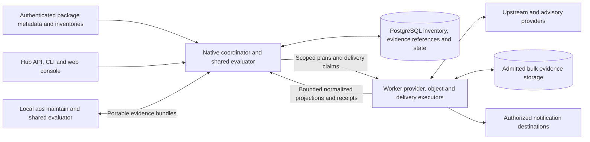

# RFC-0026: Continuous package assessment in AOS Hub

- **Status:** Proposed; implementation in progress.
- **Date:** 2026-10-08.
- **Category:** AOS protocol and application specification.
- **Audience:** Package, Hub, CLI, security, release, and platform maintainers.
- **Dependencies:** RFC-0012, RFC-0017, RFC-0018, and RFC-0023.
- **Implementation base:** The Hub integration is stacked on PR #374,
  `dplecki/hub-hybrid-topology`; the reviewed base is
  `5a2c173ce59fce593bb2ca21d28f27fa477688ff`.

## Abstract

AOS Hub continuously checks package versions and their declared components
against upstream releases and vulnerability advisories. Package metadata
declares supported scan adapters and identities. Hub maintains a normalized
inventory, durable scan operations, immutable assessments, live status,
alerts, and notification subscriptions in its authoritative database. Its
API, command-line client, and web interface expose one application contract.

The same scan engine runs locally through `aos maintain`. Local and hosted
execution share provider parsing, coverage proofs, version policy,
vulnerability matching, result contracts, and report rendering. Portable
evidence permits reproducible evaluation and validated handoffs between the
two execution environments. Neither execution environment infers package
truth from a registry filename or delegates policy to a third-party scanner.

Native, Worker, and Hybrid deployments preserve these semantics. In Hybrid,
Native coordinates scans and evaluates compact observations against nearby
PostgreSQL data. Workers perform bounded provider requests, object inspection,
and delivery. Bulk source bytes stay outside Native. Registry Git is one
inventory-ingestion adapter; it is not the assessment service's data model.

## Status of this specification

This is a project RFC, not an IETF publication. Its requirements define the
proposed implementation and interoperability contract; they do not describe
already shipped scanner features. Shared Rust crates now implement portable
inventory, deterministic assessment, provider normalization, execution contracts,
attention reduction and evidence bundles. Package metadata exports preserve
derivation identity. Hub persistence implements bounded semantic objects,
inventory admission, generation-fenced scans, provider budgets and receipts,
profile heads, attention episodes and replayable events. Application integration
and runtime adapters are being implemented against the qualification requirements
in Chapter 10. The legacy
Repology vulnerability signals do not constitute the structured CVE service
specified here. Existing contribution, release, and publication requirements
remain in force throughout rollout.

## Specification organization

The numbered chapters collectively form this specification. Requirement
language, common encoding rules, and precedence are defined in Chapter 0.
Examples illustrate the corresponding field contracts; implementation must
also satisfy the stated limits, ordering, coverage, and authorization rules.

| Chapter | Contents |
| --- | --- |
| [0. Scope and terminology](00-scope-and-terminology.md) | Requirements language, scope, invariants, terms, encoding |
| [1. Package metadata and inventory](01-package-metadata-and-inventory.md) | Scan declarations, components, signed publication, source independence |
| [2. Shared scan semantics](02-shared-scan-semantics.md) | Portable inputs, observations, findings, assessment identity, determinism |
| [3. Providers and advisory evidence](03-providers-and-evidence.md) | Provider adapters, completeness, freshness, advisory normalization |
| [4. Runtime execution protocol](04-runtime-execution-protocol.md) | Native/Worker/Hybrid roles, scoped work, results, limits, compatibility |
| [5. Database and scheduling](05-database-and-scheduling.md) | Durable entities, leases, revisions, incremental reassessment, recovery |
| [6. API and user interfaces](06-api-cli-and-web.md) | Connect services, permissions, CLI parity, pagination, live web status |
| [7. Alerts and notifications](07-alerts-and-notifications.md) | Alert transitions, subscriptions, events, outbox, delivery |
| [8. Handoffs and release policy](08-handoffs-and-release-policy.md) | Portable bundles, local binding, dispositions, promotion enforcement |
| [9. Security and operational considerations](09-security-and-operations.md) | Trust, privacy, availability, retention, telemetry, deployment |
| [10. Implementation and qualification](10-implementation-and-qualification.md) | Crate boundaries, migrations, delivery stages, conformance gates |
| [11. Decisions and references](11-decisions-and-references.md) | Alternatives, registries, normative and informative references |

A separate [advisory-trigger schema transition review](12-advisory-trigger-schema-review.md) describes the proposed durable input projection and its reset-only serving compatibility requirements. It installs no migration or database transition.

The [assessment permission policy review](13-assessment-permission-review.md) records the exact proposed permission definitions and default role matrix. It installs no permission or role grant.

## Core requirements

1. Packages describe their components and how to observe them in versioned,
   declarative metadata. Scan credentials and executable callbacks are absent.
2. Hub checks its database inventory continuously, including retained older
   versions when new advisories arrive. Reads do not start provider requests.
3. Equal frozen inputs produce equal canonical assessments across local,
   Native, Worker, and Hybrid execution.
4. In Hybrid, Native owns logical schedules, leases, budgets, policy, alerts,
   and SQL commits. Workers execute scoped physical/provider work only.
5. Missing identity, unsupported comparison, incomplete coverage, stale
   evidence, and provider failure remain visible. They cannot become a clean
   vulnerability result or a claim that a package is current.
6. Assessment changes and their durable events commit atomically. Notification
   delivery is retryable; repeated scans do not create duplicate alerts.
7. Assessments and handoff evidence bind exact metadata and artifact inputs.
   Local source modification retains RFC-0018's clean-base authorization.
8. Promotion decisions use pinned assessments and policy, independently of
   alert acknowledgement and current UI state.

## Hybrid ownership overview

Arrows summarize admitted application flows; they do not grant capabilities.
Chapter 4 defines authentication and byte limits. Native-only and Worker-only
use the same shared components with local runtime ports and their respective
authoritative database, as specified in that chapter.

## Relationship to earlier RFCs

[RFC-0018](../0018-maintainer-package-upgrades/README.md) continues to own
package-update planning, mutation, validation, and publication. This RFC
extracts and extends its observation/evaluation boundary and presentation
contracts. It does not turn a scan into permission to modify package source.

[RFC-0017](../0017-canonical-hub-publishing/README.md) continues to govern
release evidence and promotion. This RFC supplies reproducible assessments
and reviewed dispositions to those gates rather than replacing their trust
model. [RFC-0012](../0012-hub-surface-topology/README.md) supplies resource
identity, tenancy, publication, and visibility fences.

[RFC-0023](../0023-hub-hybrid-topology/README.md) supplies Hybrid ingress,
Native/PostgreSQL authority, and storage execution. Provider observation work
is a separately scoped protocol; arbitrary network requests are not added to
the storage executor. Worker-only remains a complete deployment mode.
