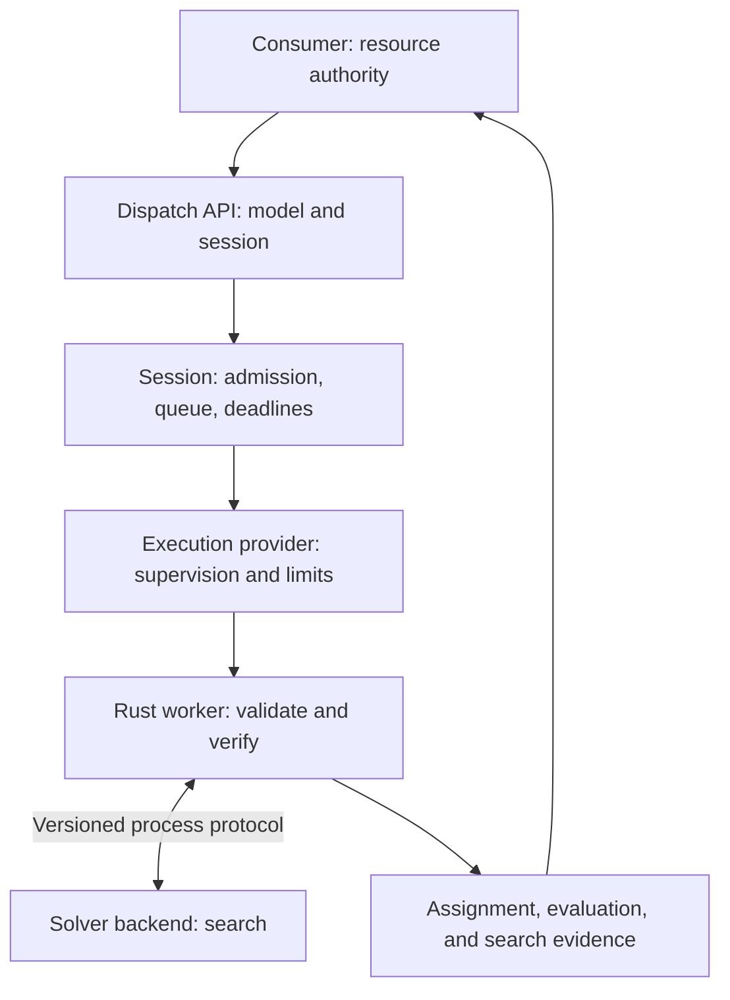

# RFC-0027: Dispatch — scoped assignment solving

- **Status:** Proposed
- **Date:** 2026-10-09
- **Intended status:** AOS architectural specification
- **Audience:** application authors, solver implementers, operating-system
  integrators, and operators

## Abstract

Dispatch provides a portable assignment model and a scoped execution interface
for allocation problems. An application describes indivisible items, eligible
destinations, resource capacities, topology, constraints, and ordered
objectives. A session executes bounded searches through a selected solver
backend and returns independently evaluated allocation proposals. Execution
providers supply process supervision, resource enforcement, and lifecycle
guarantees appropriate to the deployment.

This specification defines model semantics, session ownership, worker
protocols, result classification, backend conformance, and application
boundaries. It specifies Rebalancer as the reference native backend and
application-owned reusable workers as the preferred managed execution model.
The same model supports local libraries, language-neutral process clients,
custom supervisors, and optional remote services. Dispatch computes proposals;
resource authority and execution of those proposals remain with consumers.

## Status of this memo

This document is an AOS design proposal. Sections 1 through 12 specify the target
architecture and its conformance requirements. Informative examples illustrate
those requirements without establishing application-specific policy.

The document is divided into chapters for readability. They form one
specification; chapter boundaries do not create independent conformance
profiles.

## Contents

1. [Introduction](#1-introduction)
2. [Conventions and requirements](#2-conventions-and-requirements)
3. [Terminology](#3-terminology)
4. [Architecture](#4-architecture)
5. [Assignment model](01-assignment-model.md)
6. [Sessions and execution](02-sessions-and-execution.md)
7. [Protocols and results](03-protocols-and-results.md)
8. [Solver backends](04-backends-and-conformance.md#8-solver-backends)
9. [Conformance](04-backends-and-conformance.md#9-conformance)
10. [AOS and application interfaces](05-platform-and-consumers.md#10-aos-and-application-interfaces)
11. [Operational considerations](05-platform-and-consumers.md#11-operational-considerations)
12. [Security considerations](06-security-and-references.md#12-security-considerations)
13. [References](06-security-and-references.md#13-references)

## 1. Introduction

Distributed applications repeatedly assign work or data to a finite set of
destinations. Compute placement combines capacity and capability constraints;
storage placement combines occupancy, failure-domain separation, and movement
cost; resource scheduling combines admission, affinity, and topology. These
applications differ in authority and execution, but share substantial
assignment semantics.

Dispatch exposes those semantics as a userspace facility. Its unit of input is
an immutable problem snapshot. Its unit of execution is a solve within a
session. Its output is a proposal accompanied by exact evaluation and explicit
search evidence. A solve can describe a distributed fleet while executing on
one machine. Distributed search is not a prerequisite for distributed resource
planning.

The design has five goals:

1. Define allocation meaning independently of a particular search engine.
2. Offer an ergonomic library without requiring a global solver daemon.
3. Reuse native workers while preserving explicit ownership and resource
   boundaries.
4. Distinguish feasible proposals, authorized repair, search limitations, and
   execution failure.
5. Permit independent adoption by applications and external code bases.

Dispatch does not provide membership, leader election, distributed locking,
capacity reservations, transaction commit, or migration execution. An
application MUST retain authority over resources it applies a proposal to.
Two consumers solving independently over the same physical capacity MUST use
disjoint entitlements or a common reservation authority. Feasible mathematics
does not make simultaneous allocations serializable.

## 2. Conventions and requirements

### 2.1. Requirement language

Uppercase requirement words, including MUST, MUST NOT, SHOULD, SHOULD NOT,
RECOMMENDED, MAY, and OPTIONAL, carry the meanings defined by BCP 14
([RFC 2119](https://www.rfc-editor.org/rfc/rfc2119) and
[RFC 8174](https://www.rfc-editor.org/rfc/rfc8174)). Lowercase uses are ordinary
English. Requirements qualified by a capability apply only when that capability
is advertised.

### 2.2. Specification boundaries

The model defines assignment meaning. The backend defines search behavior. The
execution provider defines where computation occurs and which resource and
lifecycle guarantees can be enforced. A session combines these contracts
without changing them.

An implementation MUST NOT silently drop constraints, lower objective
priorities, authorize repair, permit deferral, or weaken requested execution
guarantees. Unsupported semantics MUST produce a typed rejection. Advisory
preferences MUST be distinguishable from required guarantees.

Schemas, capability descriptions, and conformance vectors MUST be available to
independent implementers. Runtime callers MUST NOT need application-specific
AOS types or access to internal solver structures to construct a problem.

Public API documentation and source comments MUST explain their contracts and
invariants directly. They MUST NOT depend on this proposal's identifier as an
explanation of behavior. Protocol and model version identifiers are separate
interoperability requirements.

## 3. Terminology

| Term | Meaning |
| --- | --- |
| Consumer | Application that submits a problem and controls adoption of its result |
| Resource owner | Principal responsible for an execution entitlement or allocatable resources; the two roles need not be identical |
| Problem | Immutable assignment model and observation basis |
| Assignment | A total binding of each modeled item to an eligible target or explicitly permitted deferred state |
| Evaluation | Exact resource usage, named violations, and objective values for an assignment |
| Verified plan | Assignment independently shown to satisfy all hard requirements for its exact problem |
| Repair plan | Assignment satisfying hard requirements and explicit repair envelopes while retaining reported debt |
| Session | Scoped submission, configuration, accounting, and lifecycle context |
| Execution provider | Implementation of worker placement, supervision, and execution guarantees |
| Backend | Implementation that compiles and searches the assignment model |
| Worker | Execution slot with at most one active solve, including materialization and verification |
| Prepared input | Session-bound handle to retained immutable input, with optional separately negotiated native preparation |
| Entitlement | Authorized aggregate resource allowance or relative scheduling importance |
| Search evidence | Backend-reported facts about search, bounds, optimality, or infeasibility |
| Observation basis | Opaque consumer reference identifying the state from which a problem was derived |

The resources in an assignment problem, such as fleet RAM or storage capacity,
are distinct from the CPU and RAM consumed to solve that problem. Dispatch MUST
account for this distinction in APIs, diagnostics, and policy.

## 4. Architecture

### 4.1. Data and control flow

A consumer captures observations and constructs an immutable problem. The
session checks admission and capability requirements, selects a worker, and
dispatches the request. The worker validates the model, obtains a candidate
from the backend, and evaluates it independently. The session returns a result
associated with the exact problem and request identities. The consumer checks
freshness and obtains any required reservation before acting.

Expensive decoding, native model construction, optimization, and verification
MUST occur inside the execution boundary promised by the provider. The
controller MAY retain bounded immutable request data and perform inexpensive
admission checks. It MUST NOT expand inputs into an unrestricted hidden solver
environment.

### 4.2. Libraries and dependency direction

| Library | Responsibility |
| --- | --- |
| `dispatch-model` | Immutable model types, validation, exact evaluation, verification, and semantic versioning |
| `dispatch-protocol` | Language-neutral schemas, framing, negotiation, and protocol/result conversion |
| `dispatch-runtime` | Sessions, admission, worker supervision, provider contracts, and backend coordination |
| `dispatch` | Consumer facade, builders, policy helpers, explanations, comparisons, and optional runtime access |

`dispatch-model` MUST be independent of native engines, execution providers,
and asynchronous runtimes. `dispatch-protocol` MAY depend on the model.
`dispatch-runtime` MAY depend on the model and protocol; it MUST NOT depend on
the consumer facade. The facade MAY re-export runtime facilities through an
optional feature. Pure validation and evaluation MUST remain available without
launching workers.

Solver-specific native compilation belongs in the backend adapter. It MUST NOT
leak into model types. Application adapters belong to consumers and MUST NOT
be required dependencies of any Dispatch library.

### 4.3. Executables and process boundaries

The `dispatch-worker` executable supplies the trusted Rust validation and
verification runner. The `dispatch-rebalancer` executable supplies the native
Rebalancer adapter. Native integration MUST use the versioned process protocol;
Rust consumers MUST NOT be required to link the C++ backend. The `dispatch`
executable provides a language-neutral command-line interface.

A managed worker consists of the runner and any backend descendants charged to
the same execution boundary. Supervision MUST retain an external mechanism for
terminating that boundary when hard cancellation is promised. Embedded
providers MAY bypass a process transport for compatible backends while
preserving the model and result contracts; they MUST advertise weaker
containment guarantees explicitly.

### 4.4. Sessions as the consumer abstraction

The public runtime abstraction is a session, not a process pool, service unit,
or cgroup. A session combines immutable initialization policy with scoped
requests and handles. Applications SHOULD select execution through authorized
profiles rather than constructing platform-specific supervision objects in
their assignment code.

Application-owned warm workers are RECOMMENDED for repeated solves under a
stable profile. Fresh workers are appropriate when an application requires a
distinct budget or separation between requests. A shared daemon is OPTIONAL.
Local consumers MUST be able to execute without one. Remote services MUST
preserve the session contract and enforce authenticated resource ownership.

### 4.5. Independent verification and trust

A backend result is an untrusted candidate. The verifier MUST use the original
Dispatch semantics and exact accounting, rather than accepting native solver
status or rounded resource values as evidence of feasibility. Verification
MUST identify its model version and input digest.

Verification establishes a relationship between a candidate and a snapshot.
It does not establish currentness, exclusive ownership, application safety, or
global optimality. The result MUST expose these limits through its types and
metadata. A consumer MUST NOT treat a serialized `verified` flag alone as
verification evidence. Import and remote verification trust are specified in
[Section 12](06-security-and-references.md#12-security-considerations).
