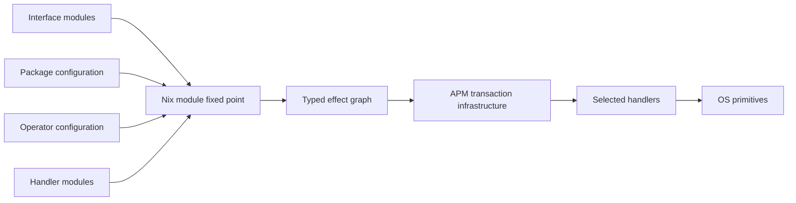
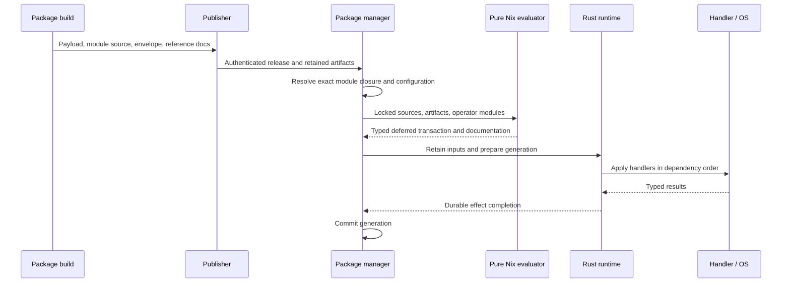

# Runtime abilities: modules, packages, and execution

An AOS package can carry both built software and a configuration module. Modules
compose through Nix's recursive `options`/`config` fixed point. Ability operations
add typed, deferred host modifications to that configuration. Evaluation produces
data; the Rust runtime executes the selected handlers later.

This guide describes the native package and runtime interface. The examples
introduce the machinery with a small service contract; production domain
contracts are documented from their actual module declarations. Implementation
and qualification progress are tracked in the [migration checklist](../../rfcs/0022-abilities-and-effects/consumer-migration.md).



This is package-level machinery. A profile, container, or host is an installation
scope using the same evaluator. Abilities are not limited to services: a package
can declare operations for filesystem paths, kernel settings, networking,
sandboxing, or another domain. Domain definitions belong to packages and system
modules. The generic library supplies module types and graph construction.

## Read an ability declaration

An ability groups named operations. Each operation declares its inputs and
results, selects a handler, and contains named effects. This schematic example
omits the interface and handler bodies; the complete service example follows.

```nix
aos.abilities.filesystem.operations.directory = {
  input = { /* Module declaring path, owner, mode, etc. */ };
  result = { /* Module declaring the returned path, etc. */ };
  handler = { /* Selected implementation module. */ };

  effects.database = {
    input.path = "/var/lib/database";
    input.mode = "0700";
    lifetime = "persistent";
  };

  effects.cache = {
    input.path = "/var/cache/example";
    input.mode = "0755";
  };
};
```

Here `filesystem` is the ability, `directory` is the operation, and `database`
and `cache` are two deferred invocations of that operation. Their arguments are
checked against the same input module and interpreted by the selected handler.

During Nix evaluation, effects are typed configuration values. They declare work;
they do not perform it. The generated graph gives each invocation an identity,
dependencies, and a lifetime. The runtime executes the handler later and checks
its returned values against the result module. An effect's `outputs` contains
typed references to those future results, not values already produced by Nix.

The database invocation explicitly retains its state until retirement. The cache
invocation uses the default `instance` lifetime: its handler is asked to remove
the managed state when the effect disappears from desired configuration. The
handler defines the actual removal behavior.

## Define an interface with ordinary modules

An ability groups operations. Each operation owns an input module, a result
module, an optional handler module, and configured effect instances:

```nix
{ lib, ... }: {
  aos.abilities.service.operations.ensure = {
    input = { name, lib, ... }: {
      options = {
        name = lib.mkOption {
          type = lib.types.str;
          default = name;
          description = "Name of the service instance.";
        };
        command = lib.mkOption {
          type = lib.types.listOf lib.types.str;
          description = "Program and arguments to run.";
        };
      };
    };

    result.options.handle = lib.mkOption {
      type = lib.types.str;
      description = "Service identity returned by the manager.";
    };
  };
}
```

These are mergeable module definitions. Another file can extend the same input:

```nix
{ lib, ... }: {
  aos.abilities.service.operations.ensure.input.options.after = lib.mkOption {
    type = lib.types.listOf lib.types.str;
    default = [];
    description = "Service names that must be started first.";
  };
}
```

The resulting operation sees both definitions. Normal module imports, defaults,
priorities, conditional configuration, and type checking apply. There is no
parallel registry of interface schemas, providers, requests, and documentation.
The operation's read-only `module` value exposes its effect submodule for reuse
by composed handlers.

## Offer a convenient domain option

The service manager can reuse that exact input schema under `aos.services` and
derive effects from the final merged configuration:

```nix
{ config, lib, ... }: {
  options.aos.services = lib.mkOption {
    default = {};
    extensible = true;
    type = lib.types.lazyAttrsOf (lib.types.submodule [
      config.aos.abilities.service.operations.ensure.input
      { options.enable = lib.mkEnableOption "this service"; }
    ]);
  };

  config.aos.abilities.service.operations.ensure.effects =
    lib.mapAttrs
      (_: service: {
        input = builtins.removeAttrs service [ "enable" ];
      })
      (lib.filterAttrs (_: service: service.enable) config.aos.services);
}
```

There is one declaration of `command`, `name`, and `after`. Extending the operation
input extends the public service configuration too. Separate modules may set
attributes of the same `aos.services.web` instance; the evaluator merges them
before the manager derives an effect. `extensible` exposes this package-owned
option as an extension point to other package modules. The manager owns that derived effect's
lifecycle even when several packages supplied its settings.

A daemon's package module supplies its default command:

```nix
{ package, lib, ... }: {
  aos.services.web.command = [ (lib.getExe package) "--foreground" ];
}
```

An operator enables the instance and sets policy:

```nix
{
  aos.services.web = {
    enable = true;
    after = [ "network" ];
  };
}
```

The daemon does not need an `instances.service = {};` declaration. Its ordinary
configuration is enough. A domain that needs no convenience layer may configure
`aos.abilities.<ability>.operations.<operation>.effects.<name>.input` directly.

## Select or compose a handler

An implementation package can select its own built program:

```nix
{ package, ... }: {
  aos.abilities.service.operations.ensure.handler.program = package;
}
```

`package` is the explicit retained artifact supplied to that module, including
its outputs and `mainProgram`. Build-time handlers may also use derivations.
The evaluator lowers this Nix value to an immutable program reference; users do
not duplicate an executable string or manually maintained revision number.

A richer service manager can compose lower operations instead. Suppose
`init.install` accepts `name` and `command`, returning `path`, while
`supervision.ensure` accepts `definition` and `after`, returning `handle`.
Declare `definition` with `lib.types.deferred lib.types.str` so it can receive
the earlier operation's result:

```nix
{ config, ... }:
let
  install = config.aos.abilities.init.operations.install;
  supervise = config.aos.abilities.supervision.operations.ensure;
in {
  aos.abilities.service.operations.ensure.handler =
    { input, children, ... }: {
      children.definition = {
        imports = [ install.module ];
        input = { inherit (input) name command; };
      };
      children.running = {
        imports = [ supervise.module ];
        input = {
          definition = children.definition.outputs.path;
          inherit (input) after;
        };
      };
      exports.handle = children.running.outputs.handle;
    };
}
```


The output reference creates an execution dependency. No Nix expression waits
for a running service or reads a runtime result during evaluation. Rust resolves
references after their producer completes and checks result types before the
consumer runs. The parent exports the child's result without launching a second
parent process.

`input.after` in this example is service-manager policy. An effect's own `after`
field is an explicit activation dependency expressed using output references;
these are different kinds of ordering.

Different implementations may fulfill a rich interface with a single manager
or several cooperating programs. Selecting one is ordinary module configuration.
Incompatible definitions or missing required input fields fail evaluation.
A configured, enabled operation with no handler fails graph construction before
activation. Merely declaring an unused interface, or generating reference
documentation, does not require a handler. Missing functionality is never
silently dropped.

## Build and publish the package

A recipe keeps its ordinary build inputs and adds a module directory:

```nix
{ mkDerivation, service-interface, ... }:
mkDerivation {
  pname = "web-server";
  version = "1";
  # Source, build dependencies, phases, and runtime dependencies go here.
  module = ./web-server-module; # Contains module.nix.
  moduleDeps = [ service-interface ];
}
```

`moduleDeps` supplies configuration interfaces or implementations. It is
separate from `buildDeps` and `runtimeDeps`. An ordinary payload-only package
needs no module; it still publishes a native deployment envelope.

## Version and compose interfaces across packages

Interfaces follow the release of their owner. An interface shipped by a package
uses that package's version; interfaces supplied by the OS/base modules use the
OS release version. Ability declarations contain their operations and schemas,
without an independent ability version. An effect's automatic revision remains
separate from release compatibility.

A package recipe's `version` also declares its compatibility promise. A bare
strict SemVer such as `"7.4.2"` defaults to caret compatibility. `"^7.4.2"`,
`"~7.4.2"`, and `"=7.4.2"` publish the same exact package version `7.4.2`, with
caret, tilde, and equal-version requirements respectively. Other bare version
schemes remain exact-only. This shorthand accepts one optional operator followed
by a full release version, not compound ranges; there is no separate
`moduleCompatibility` field.

Recipes select this policy for their exposed interface. BIND, for example, uses
`~9.20.27` to stay within its documented stable branch; a package without a
reviewed broader guarantee uses an equal-version requirement. This does not
change the source release used for download or build. Selected outputs and
bootstrap publication preserve the owning recipe's policy.

Source-language compatibility, binary ABI compatibility, configuration migration,
and supported upgrade paths are separate promises. A range does not perform
required migrations or enforce cluster version skew. AOS module authors must
also preserve their own option and operation contracts within the declared range.

Generated `package.versionRequirement` retains the inferred requirement. A
consumer can therefore write `moduleDeps = [ service-interface ];` without
repeating the interface package's declared range. Consumers capture that range
when their companions are generated; narrowing a provider recipe does not
retroactively change an already-published consumer's retained requirement.
Regenerate and publish those consumer companions to adopt the revised policy.
To override the range, use an explicit requirement:

```nix
{ mkDerivation, service-interface, ... }:
mkDerivation {
  pname = "web-server";
  version = "3.0.0";
  module = ./web-server-module;
  moduleDeps = [
    {
      package = service-interface;
      packageVersion = "^7.0";
    }
  ];
  osVersion = "^1.0"; # Optional requirement on the selected host OS release.
  # Ordinary source, dependencies, and build phases go here.
}
```

`package` supplies the exact build-time seed. Nix checks its package version
against the inferred or overridden range. APM may select another authenticated
release of the same package that satisfies the range. Package `7.3.0` satisfies
`^7.0`; package `8.0.0` does not. Declare each dependency package once.

Use `moduleDeps = [ { package = service-interface; exact = true; } ];` to pin the
immutable source identity. This differs from `packageVersion = "=7.4.2"`, which
requires that semantic version but can select another source with that version.

`osVersion` constrains the OS release already selected for the host, retained as
`osRelease = { name = "aos"; version = "1.2.0"; }` in activation inputs. The host OS
is a fixed input: dependency resolution checks it and never solves for or upgrades
it. A mismatch requires a compatible package choice or a separately managed OS
upgrade. Omitting the requirement imposes no explicit OS release range.

Keep interface changes compatible with the previous release's captured
requirement. Caret policy normally permits a breaking change at the next major
release; tilde and equal-version policies have narrower guarantees. A new
release's policy cannot relax the previous release's obligations. OS release
versions remain exact declarations, with default caret policy for the structural
check. SemVer is the author's compatibility promise, not a proof that arbitrary
Nix modules are interchangeable. Modules can still extend shared option trees.

Range matching and the structural release check require strict SemVer release
numbers. Packages with other upstream version schemes can still use exact
dependencies; AOS does not guess a SemVer interpretation.

Ranges use Rust SemVer syntax: caret, tilde, comparisons, wildcards, and
comma-separated intersections. Prereleases require an explicit prerelease
comparator for the same major/minor/patch. A version is bounded to 128 bytes and a
range to 4,096 bytes and 32 comparators.

Repositories can obtain interface packages through pinned Nix inputs. For
example, a flake can pass an external AOS interface package to this recipe:

```nix
# Inside a flake's outputs, with `aosPkgs` the target AOS package set:
aosPkgs.callPackage ./web-server.nix {
  service-interface = inputs.interfaces.packages.${system}.service-interface;
}
```

The external package must expose AOS's native `module` and deployment companions.
Flakes acquire build inputs; they are not runtime header lookups. Publication
retains the module source, original dependencies, generated interface release
metadata, and documentation in authenticated package artifacts. Installation uses the configured
registries, which may publish packages from different Git repositories. A
dependency does not add registry URLs, signing keys, or trust settings. Package
names remain scope-wide identities; aliases for local registries do not namespace
them.

Resolution selects **one exact package identity per package name per scope**.
Package-owned interfaces follow that selection; OS-owned interfaces follow the
fixed host OS release. The resolver solves transitive ranges together, including
constraints introduced by candidate packages. Conflicting consumers
fail with dependency diagnostics before activation. The bounded solver reports
search exhaustion separately from incompatible requirements. Ordinary installation
prefers compatible retained choices; an explicit upgrade permits new selections,
even when the application payload is unchanged. Upgrade filters, exclusions, and
holds preserve the dependency choices of unaffected package owners. A shared
dependency must still satisfy those retained choices. An unchanged resolution
does not create a new generation.

The resulting resolution lock records original requirements, exact selected
module sources, and the requesters' deployment companions. Reconfiguration,
boot, and rollback replay these choices without consulting newer registry
contents. New package mutations snapshot the currently selected target OS release;
an old user profile does not keep admitting packages against an obsolete host
version. Pending transaction recovery and rollback check retained package
requirements against that current target before applying effects. Historical
source replay preserves its original OS identity. Build-time images lock their
selected seeds using the same format.
Handler selection remains ordinary module configuration; resolving a compatible
interface does not discover or select an unrelated service manager, nor rewrite
compiled runtime dependencies or literal store paths embedded in modules.

Generated reference documentation uses these same declarations to show interface
release owners and links to requesting packages. `moduleRequirements` records
`owner`, `package`, and `packageVersion`; `osRequirements` records `owner` and
`osVersion`. `aos docs` and the Hub expose this metadata without a
second manually maintained ability catalog.

A structural compatibility check compares the generated public input/result
schemas from the previous and current release, together with their package or OS
release owner. Removed operations or fields, newly required inputs, and type
changes are breaking changes or require review. Optional inputs and new
operations are compatible additions. Opaque constraints require human review;
the check does not prove runtime behavior. A breaking change is permitted when
the new release falls outside the previous release's captured compatible range,
or through a documented exception explaining the exact change and why it is
permitted. This is a focused release check, not another schema catalog.

Compare the generated native references for two releases:

```sh
aos ability check-compat before-options.json after-options.json --owner service-interface
aos ability check-compat before-options.json after-options.json --os
```

Use `--owner` for interfaces owned by the named package or `--os` for OS/base
interfaces. The check reports structural changes and checks whether the new
release is outside the previous release's compatibility guarantee. An incompatible
report is still printed before the command exits unsuccessfully. `--json` emits the report as JSON.

For a reviewed exception, pass `--exceptions exceptions.json`. The file is a JSON
array naming the exact diagnostic ID and the reason it is permitted:

```json
[
  {
    "id": "COPY_THE_REPORTED_DIAGNOSTIC_ID",
    "reason": "Explain why this exact release change is permitted."
  }
]
```

## Bind runtime dependencies

A runtime dependency list uses each package's name as its module binding.
Use a named attribute set when dependencies have distinct roles, including two
artifacts from the same package:

```nix
runtimeDeps = {
  predecessor = previousImage;
  candidate = nextImage;
};
```

The retained module receives `dependencies.predecessor` and
`dependencies.candidate` as artifact values. Each keeps its actual package name,
version, selected output, and available outputs; the binding name does not
rename the package. Interpolation such as `"${dependencies.candidate}"` retains
the selected artifact in the effect graph. The payload builder consumes the
same dependency values as an ordinary list.

Selecting an output installs that payload. The envelope's `outputs` map describes
other authenticated outputs that modules may reference; it does not install or
retain all of them. Module dependencies make configuration available without
installing their payloads. Evaluation adds outputs actually used by the bound
graph to the transaction's retained inputs. Runtime dependencies remain governed
by the selected payload's actual store references. The pre-evaluation descriptor
also retains the real deployment envelopes for module-only dependencies, so
subsequent offline reconfiguration can resolve their original dependency edges.
These metadata companions do not select additional payload outputs.

| Build output | Contents |
| --- | --- |
| Package outputs | Built software and runtime dependencies |
| `module` | Immutable source directory, with `module.nix` as entry point |
| `deploymentArtifact/deployment.json` | `aos.package.deployment` envelope: platform, payload outputs, runtime dependency artifacts, module source and module dependencies |
| `documentationArtifact/options.json` | `aos.module.documentation`: options and operation reference generated from module evaluation |

The derivation also exposes the corresponding `deployment` and `documentation`
Nix values. Once the example package is registered in the package set, the
reference can be exported without building its handler:

```sh
nix eval --json --file . pkgs.web-server.documentation > options.json
```

Use the actual registered package name in that command. Descriptions belong beside `mkOption`; reference pages are derived
from those declarations and definition provenance. Do not author a second
ability catalog or option table for documentation.

Publication retains these artifacts and the exact module closure alongside the
authenticated release. Native release metadata identifies each companion by its
store identity, NAR hash, and exact document digest. Hub validates those bindings
before indexing the generated options and operations. Publication does not
execute effects; a locally imported document is an inspection view, not an
authenticated release.

## Evaluate an installation scope

For already selected build-time packages:

```nix
lib.evalPackageModules {
  scope = [ "host" "main" ];
  packages = [ web-server selected-service-backend ];
  operatorModules = [ { aos.services.web.enable = true; } ];
}
```

The names in this example stand for packages defining the interfaces above.
The result contains `config`, `options`, `documentation`, and `deployment`.
`deployment` has schema `aos.package.transaction`; its `graph` is the generated
`aos.activation.graph`. The graph is serialized output, not another tree for
operators to configure.

On a deployed system, the package manager supplies resolved immutable module
sources and explicit artifacts instead of constructing derivations. Module
arguments include `package`, `dependencies`, `packageName`, `packageVersion`,
`lib`, `config`, and `options`. Inline modules can compose with imported files;
file imports remain inside retained source roots.



The Rust entry points are `deployment::evaluation::{resolve_packages, Evaluation}`
and `deployment::transaction::Transactions` in `aos-package`. Evaluation uses
stock Nix in pure/restricted mode with fixed source inputs and import-from-
derivation disabled. It builds nothing and executes no host modification.
Package/version/source conflicts fail before execution.

### Retain inputs before producing the graph

Production evaluation also retains an `aos.package.evaluation-input` document.
It identifies the immutable module library and its NAR hash, installation scope,
resolved packages, ordered baseline modules, operator configuration snapshot, and
supplemental retained inputs. Its `moduleEnvelopes` map retains the authenticated
companion for every resolved module, including dependencies whose payloads are
not installed. Offline reconfiguration reads those exact companions; it does
not reconstruct package declarations from flattened configuration.

Supplemental inputs are evidence or artifacts, not modules to import; their original admission must survive later reconfiguration.
It contains no output graph. Packages that need to perform another authorized
evaluation receive its immutable path as the `evaluationInput` module argument:

```nix
{ evaluationInput, ... }: {
  aos.abilities.example.operations.evaluate.effects.main.input.source =
    evaluationInput;
}
```

Here `example.evaluate` stands for a package-owned operation whose `source`
option accepts that retained descriptor. The path is an ordinary operation
input, so revision tracking and retention apply without a separate invocation
context channel. A caller authenticates the descriptor and its source identities
before admitting it; merely parsing a descriptor establishes no authority.

Baseline modules remain authored source files, rather than snapshots of their
final merged defaults. Reconfiguration replaces the operator snapshot and
reevaluates the new package closure against those sources. Different outputs of
one package share one module identity; selected payload outputs remain explicit.

A retained descriptor can also be replayed without activation:

```sh
aos ability evaluate /nix/store/…-evaluation-input.json --nix-store "$AOS_NIX_STORE"
```

This emits a checked native transaction, verifies the declared library NAR, and
keeps source roots alive during pure evaluation. It creates no profile generation
or effect journal. It checks input integrity; authenticating the descriptor and
its original source authority remains the caller's responsibility.

The selected Nix store supplies source bytes through its store accessor. The
evaluator exports each distinct source root as a bounded NAR and restores a
private, hash-locked read view for pure Nix. This also works when the selected
store's logical paths are absent from the machine's `/nix/store`. Temporary read
locations do not replace the original source identities in the descriptor or
transaction. Source loading and evaluation share one deadline; each source NAR
is limited to 64 MiB.

## Runtime state, reconfiguration, and recovery

A process handler implements `apply`, `remove`, and `observe`, accepting a JSON
invocation on stdin. Apply returns the declared result object; remove returns
an empty object. Observe reports current results, absence, a safe retry, or an
indeterminate outcome. See the [execution contract](../../rfcs/0022-abilities-and-effects/execution-contract.md)
for the wire boundary and source locations.

Logical effect identity includes the installation scope, declaring package,
ability, operation, and instance name. Composed children also include their
parent. Upgrading a package does not change that identity merely because its
version or store path changes. Semantic inputs and handler artifacts determine
the revision automatically; changing descriptions does not trigger an update.
`after` establishes execution order. A dependency's result belongs in `input`
when changes to that result should change the consumer's resolved revision.
Portable type constraints are checked after Nix merging and again after runtime
result substitution.

| Lifetime | Retention |
| --- | --- |
| `instance` (default) | Reconcile across generations; remove when the configured instance disappears |
| `transaction` | Remove after its dependent operations finish |
| `persistent` | Retain until explicitly retired, including after package removal |

Explicit retirement is part of the ordinary configuration evaluated into the
transaction:

```nix
{
  aos.activation.retire = [ "<retained-effect-id>" ];
}
```

Use an exact identity from retained runtime state. It must be absent from the
new configured graph and present in the retained or durably retired effect
inventory. Keeping a completed retirement declaration in later generations is a
no-op; an unknown identity is rejected. Removing a
package or pruning a generation alone does not retire persistent state.

Reconfiguration prepares a new desired document. Handlers receive previous
state when inputs or implementations change. Interrupted mutations are observed
before retry. Effect completion and generation commit are separately durable;
a retained transaction receipt prevents replaying completed one-shot work after
a crash between them.

Rollback applies an older retained desired document as a new transaction. It
is not automatic reversal of arbitrary external actions. Pruning old generations
releases their artifact roots; persistent effects retain separate handler roots.
Current-generation pruning is rejected. Journals are bounded and currently have
no automatic compaction; pruning roots does not reclaim journal bytes.

Image construction selects package/module slices for the host, initrd, and
container. Host activation uses the same `profile/system` scope and generation
journal as subsequent package changes. The image supplies the initial desired
state; subsequent boots reconcile the committed profile and recover pending
work. They must not overwrite an installed profile with the original image's
package selection. Container images select a smaller package-managed base.

On the first host activation, the image's immutable bootstrap policy says
whether platform metadata is required. When required, the bootstrap bridge
checks the exact committed initrd result, retains the accepted host configuration
and facts with their original receipt, and evaluates them before any host
effects run. Later boots recover the existing profile and preserve subsequent
operator changes. They do not reacquire metadata as a replacement for accepted
configuration.

Initrd evaluates the accepted configuration only far enough to obtain the typed
`aos.provisioning.storage` plan. It validates and persists that plan before disk
changes. The capsule retains the original library, module sources, configuration,
and evidence required for this projection; describing the host's available
artifacts does not pull their payloads into initrd. The projection descriptor has
the same data as the host descriptor, with a smaller retained closure.

The host then evaluates and validates the complete activation graph before
running host effects. This is a phase boundary: provisioning checks run before
disk changes, while failures in unrelated host configuration may be discovered
later. The accepted configuration and its original receipts remain available
across that boundary.

Configuration-lower construction is an OS-owned operation. Its immutable output
is retained by the native transaction and mounted before dependent file and
service operations. Image path provenance lets removal hide obsolete baseline
entries while preserving unrelated operator edits.

Optional execution observers receive only transaction/effect identities and
journal boundaries, without arguments or results. An observer failure stops
execution; recovery observes the exact durable invocation before retry. Observer
acknowledgements cannot supply a handler outcome. `dispatch-started` records an
attempt boundary immediately before calling the handler, including attempts
whose call fails. It does not prove the call ran: interruption can occur between
acknowledgement and dispatch. A missing `dispatch-returned` event therefore does
not establish that no attempt occurred. The observer must already be
available before the first observed dispatch; it cannot observe its own creation.
Image-owned startup or an externally supplied test listener can establish that
prerequisite.

Read-only journal inspection uses the same bounded replay model as activation:

```sh
aos ability journal activation.journal --format json
```

It distinguishes desired state, pending invocations, and durable completion.
It does not query live services or repair an interrupted journal. Package
inspection also holds a shared generation-journal lock while reading its checked
snapshot and associated profile publication. Incomplete final frames are
reported and left unchanged.

The current process transport uses Linux facilities; another execution platform
needs a transport implementation as well as its own domain handlers. These
interfaces do not themselves establish whole-system boot qualification.

## Image artifacts and runtime handlers

Image construction and delivery use two documents with separate responsibilities.
`image-info.json` describes the provider's actual filesystem, partition layout,
and EFI artifacts. `image-delivery.json` describes the downloadable encoding,
filename, digest, size, and compatible targets. Converting a raw image changes
the delivery document while retaining the provider document byte for byte.

The image staging handler reads component paths and identities from the retained
provider document. It verifies the selected components before using them; it
does not guess filenames from a slot name. Self-contained builds and external
finalization share the canonical serializer. Fields requiring measurements or
assembly commitments are emitted only when the producer has those facts.
Publishing these artifacts still does not execute an image transition.

## Inspect the generated reference and execution path

The native reader works without Nix, a repository checkout, or a running AOS
system:

```sh
aos docs runtime options.json
aos docs runtime transaction.json --format json
aos docs runtime transaction.json --format html --output execution.html
```

`docs` is an alias for `doc`. A package's `options.json` shows operation inputs,
results, option descriptions, and the packages that declare contracts, select
handlers, and configure effects. A transaction shows the selected graph's
ordered effects, owners, dependencies, handlers, lifetimes, and revisions.
These are configured relationships, not observations of running processes.
Conditional uses absent from the evaluated configuration cannot be inferred.

In AOS Hub, open `/-/runtime-abilities`, choose or paste one of these documents,
and select **Inspect document**. Links connect package/environment owners to
operations and back; transaction dependencies link to their producer effects.
The form submits the document to the Hub for rendering without retaining it.
Use a Hub appropriate for the configuration you are inspecting.

The read-only API accepts raw document JSON:

```sh
curl --data-binary @options.json -H 'Content-Type: application/json' \
  'https://hub.example/-/api/runtime-documentation?format=html'
```

Omit `format=html` to return the parsed JSON after structural validation.
Inspection does not authenticate a release, evaluate configuration, or activate
a graph. Installed-package documentation and Hub release browsing use the same
native reader with their own authenticated package/release context. Package
pages distinguish declarations from configured deployment effects. A system's
reported desired graph and observed state are separate assertions; a document
digest alone is not evidence that a handler ran.

The executable integration example is
[`package_deployment_check`](../../../crates/aos-package/examples/package_deployment_check.rs),
using the source-built [`checks.effects` fixture](../../../tests/effects/deployment-fixture.nix).
It exercises artifact publication, deployment-time evaluation, real handler
execution, generation reopening, reconfiguration, and pruning. It provides a
small executable example of the shared infrastructure boundary.
