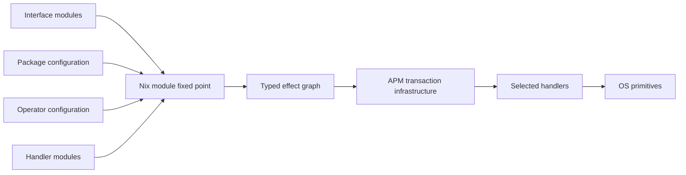
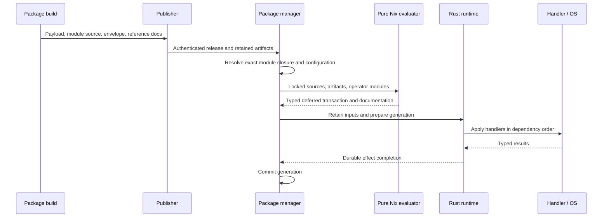

# Runtime abilities: modules, packages, and execution

An AOS package can carry both built software and a configuration module. Modules
compose through Nix's recursive `options`/`config` fixed point. Ability operations
add typed, deferred host modifications to that configuration. Evaluation produces
data; the Rust runtime executes the selected handlers later.

The native infrastructure described here is implemented. Existing package,
registry, image, and installation consumers are being migrated separately. The
service examples below demonstrate the API; they do not imply that the existing
service packages already use it. The [migration handoff](../../rfcs/0022-abilities-and-effects/consumer-migration.md)
identifies that boundary.



This is package-level machinery. A profile, container, or host is an installation
scope using the same evaluator. Abilities are not limited to services: a package
can declare operations for filesystem paths, kernel settings, networking,
sandboxing, or another domain. Domain definitions belong to packages and system
modules. The generic library supplies module types and graph construction.

## Define an interface with ordinary modules

An ability groups operations. Each operation owns an input module, a result
module, an optional handler module, and configured effect instances:

```nix
{ lib, ... }: {
  aos.abilities.service.operations.ensure = {
    input = { name, lib, ... }: {
      options = {
        name = lib.mkOption {
          type = lib.types.str;
          default = name;
          description = "Name of the service instance.";
        };
        command = lib.mkOption {
          type = lib.types.listOf lib.types.str;
          description = "Program and arguments to run.";
        };
      };
    };

    result.options.handle = lib.mkOption {
      type = lib.types.str;
      description = "Service identity returned by the manager.";
    };
  };
}
```

These are mergeable module definitions. Another file can extend the same input:

```nix
{ lib, ... }: {
  aos.abilities.service.operations.ensure.input.options.after = lib.mkOption {
    type = lib.types.listOf lib.types.str;
    default = [];
    description = "Service names that must be started first.";
  };
}
```

The resulting operation sees both definitions. Normal module imports, defaults,
priorities, conditional configuration, and type checking apply. There is no
parallel registry of interface schemas, providers, requests, and documentation.
The operation's read-only `module` value exposes its effect submodule for reuse
by composed handlers.

## Offer a convenient domain option

The service manager can reuse that exact input schema under `aos.services` and
derive effects from the final merged configuration:

```nix
{ config, lib, ... }: {
  options.aos.services = lib.mkOption {
    default = {};
    extensible = true;
    type = lib.types.lazyAttrsOf (lib.types.submodule [
      config.aos.abilities.service.operations.ensure.input
      { options.enable = lib.mkEnableOption "this service"; }
    ]);
  };

  config.aos.abilities.service.operations.ensure.effects =
    lib.mapAttrs
      (_: service: {
        input = builtins.removeAttrs service [ "enable" ];
      })
      (lib.filterAttrs (_: service: service.enable) config.aos.services);
}
```

There is one declaration of `command`, `name`, and `after`. Extending the operation
input extends the public service configuration too. Separate modules may set
attributes of the same `aos.services.web` instance; the evaluator merges them
before the manager derives an effect. `extensible` exposes this package-owned
option as an extension point to other package modules. The manager owns that derived effect's
lifecycle even when several packages supplied its settings.

A daemon's package module supplies its default command:

```nix
{ package, lib, ... }: {
  aos.services.web.command = [ (lib.getExe package) "--foreground" ];
}
```

An operator enables the instance and sets policy:

```nix
{
  aos.services.web = {
    enable = true;
    after = [ "network" ];
  };
}
```

The daemon does not need an `instances.service = {};` declaration. Its ordinary
configuration is enough. A domain that needs no convenience layer may configure
`aos.abilities.<ability>.operations.<operation>.effects.<name>.input` directly.

## Select or compose a handler

An implementation package can select its own built program:

```nix
{ package, ... }: {
  aos.abilities.service.operations.ensure.handler.program = package;
}
```

`package` is the explicit retained artifact supplied to that module, including
its outputs and `mainProgram`. Build-time handlers may also use derivations.
The evaluator lowers this Nix value to an immutable program reference; users do
not duplicate an executable string or manually maintained revision number.

A richer service manager can compose lower operations instead. Suppose
`init.install` accepts `name` and `command`, returning `path`, while
`supervision.ensure` accepts `definition` and `after`, returning `handle`.
Declare `definition` with `lib.types.deferred lib.types.str` so it can receive
the earlier operation's result:

```nix
{ config, ... }:
let
  install = config.aos.abilities.init.operations.install;
  supervise = config.aos.abilities.supervision.operations.ensure;
in {
  aos.abilities.service.operations.ensure.handler =
    { input, children, ... }: {
      children.definition = {
        imports = [ install.module ];
        input = { inherit (input) name command; };
      };
      children.running = {
        imports = [ supervise.module ];
        input = {
          definition = children.definition.outputs.path;
          inherit (input) after;
        };
      };
      exports.handle = children.running.outputs.handle;
    };
}
```


The output reference creates an execution dependency. No Nix expression waits
for a running service or reads a runtime result during evaluation. Rust resolves
references after their producer completes and checks result types before the
consumer runs. The parent exports the child's result without launching a second
parent process.

`input.after` in this example is service-manager policy. An effect's own `after`
field is an explicit activation dependency expressed using output references;
these are different kinds of ordering.

Different implementations may fulfill a rich interface with a single manager
or several cooperating programs. Selecting one is ordinary module configuration.
Incompatible definitions or missing required input fields fail evaluation.
A configured, enabled operation with no handler fails graph construction before
activation. Merely declaring an unused interface, or generating reference
documentation, does not require a handler. Missing functionality is never
silently dropped.

## Build and publish the package

A recipe keeps its ordinary build inputs and adds a module directory:

```nix
{ mkDerivation, service-interface, ... }:
mkDerivation {
  pname = "web-server";
  version = "1";
  # Source, build dependencies, phases, and runtime dependencies go here.
  module = ./web-server-module; # Contains module.nix.
  moduleDeps = [ service-interface ];
}
```

`moduleDeps` supplies configuration interfaces or implementations. It is
separate from `buildDeps` and `runtimeDeps`. An ordinary payload-only package
needs no module.

| Build output | Contents |
| --- | --- |
| Package outputs | Built software and runtime dependencies |
| `module` | Immutable source directory, with `module.nix` as entry point |
| `deploymentArtifact/deployment.json` | `aos.package.deployment` envelope: platform, payload outputs, runtime dependency artifacts, module source and module dependencies |
| `documentationArtifact/options.json` | `aos.module.documentation`: options and operation reference generated from module evaluation |

The derivation also exposes the corresponding `deployment` and `documentation`
Nix values. Once the example package is registered in the package set, the
reference can be exported without building its handler:

```sh
nix eval --json --file . pkgs.web-server.documentation > options.json
```

Use the actual registered package name in that command. Descriptions belong beside `mkOption`; reference pages are derived
from those declarations and definition provenance. Do not author a second
ability catalog or option table for documentation.

A publisher must retain these artifacts and the exact module closure alongside
the authenticated release. Publication does not execute effects. Integration
with existing APR/Hub release metadata and indexes is a remaining consumer
migration; generating these artifacts alone does not make them discoverable
through existing package search.

## Evaluate an installation scope

For already selected build-time packages:

```nix
lib.evalPackageModules {
  scope = [ "host" "main" ];
  packages = [ web-server selected-service-backend ];
  operatorModules = [ { aos.services.web.enable = true; } ];
}
```

The names in this example stand for packages defining the interfaces above.
The result contains `config`, `options`, `documentation`, and `deployment`.
`deployment` has schema `aos.package.transaction`; its `graph` is the generated
`aos.activation.graph`. The graph is serialized output, not another tree for
operators to configure.

On a deployed system, the package manager supplies resolved immutable module
sources and explicit artifacts instead of constructing derivations. Module
arguments include `package`, `dependencies`, `packageName`, `packageVersion`,
`lib`, `config`, and `options`. Inline modules can compose with imported files;
file imports remain inside retained source roots.



The Rust entry points are `deployment::evaluation::{resolve_packages, Evaluation}`
and `deployment::transaction::Transactions` in `aos-package`. Evaluation uses
stock Nix in pure/restricted mode with fixed source inputs and import-from-
derivation disabled. It builds nothing and executes no host modification.
Package/version/source conflicts fail before execution.

## Runtime state, reconfiguration, and recovery

A process handler implements `apply`, `remove`, and `observe`, accepting a JSON
invocation on stdin. Apply returns the declared result object; remove returns
an empty object. Observe reports current results, absence, a safe retry, or an
indeterminate outcome. See the [execution contract](../../rfcs/0022-abilities-and-effects/execution-contract.md)
for the wire boundary and source locations.

Logical effect identity includes the installation scope, declaring package,
ability, operation, and instance name. Composed children also include their
parent. Upgrading a package does not change that identity merely because its
version or store path changes. Semantic inputs and handler artifacts determine
the revision automatically; changing descriptions does not trigger an update.

| Lifetime | Retention |
| --- | --- |
| `instance` (default) | Reconcile across generations; remove when the configured instance disappears |
| `transaction` | Remove after its dependent operations finish |
| `persistent` | Retain until explicitly retired, including after package removal |

Reconfiguration prepares a new desired document. Handlers receive previous
state when inputs or implementations change. Interrupted mutations are observed
before retry. Effect completion and generation commit are separately durable;
a retained transaction receipt prevents replaying completed one-shot work after
a crash between them.

Rollback applies an older retained desired document as a new transaction. It
is not automatic reversal of arbitrary external actions. Pruning old generations
releases their artifact roots; persistent effects retain separate handler roots.
Current-generation pruning is rejected. Journals are bounded and currently have
no automatic compaction; pruning roots does not reclaim journal bytes.

Boot and image consumers must select and retain their backend packages, submit
the appropriate scope to this same transaction infrastructure, and resume
pending work before starting another generation. The production boot/install
entry points have not yet been moved to that path. The current process transport
also uses Linux facilities; alternate execution platforms need a transport
implementation as well as their own domain handlers.

## Inspect the generated reference and execution path

The native reader works without Nix, a repository checkout, or a running AOS
system:

```sh
aos docs runtime options.json
aos docs runtime transaction.json --format json
aos docs runtime transaction.json --format html --output execution.html
```

`docs` is an alias for `doc`. A package's `options.json` shows operation inputs,
results, option descriptions, and the packages that declare contracts, select
handlers, and configure effects. A transaction shows the selected graph's
ordered effects, owners, dependencies, handlers, lifetimes, and revisions.
These are configured relationships, not observations of running processes.
Conditional uses absent from the evaluated configuration cannot be inferred.

In AOS Hub, open `/-/runtime-abilities`, choose or paste one of these documents,
and select **Inspect document**. Links connect package/environment owners to
operations and back; transaction dependencies link to their producer effects.
The form submits the document to the Hub for rendering without retaining it.
Use a Hub appropriate for the configuration you are inspecting.

The read-only API accepts raw document JSON:

```sh
curl --data-binary @options.json -H 'Content-Type: application/json' \
  'https://hub.example/-/api/runtime-documentation?format=html'
```

Omit `format=html` to return the parsed JSON after structural validation.
Inspection does not authenticate a release, evaluate configuration, or activate
a graph. Existing installed-package documentation, release search, and
`aos ability` inspection still use their previous consumer formats; the native
viewer deliberately does not adapt those formats.

The executable integration example is
[`package_deployment_check`](../../../crates/aos-package/examples/package_deployment_check.rs),
using the source-built [`checks.effects` fixture](../../../tests/effects/deployment-fixture.nix).
It exercises artifact publication, deployment-time evaluation, real handler
execution, generation reopening, reconfiguration, and pruning. It provides a
small concrete starting point for the remaining consumers.
